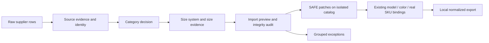

# РУБІЖ PIM — план интеграции категорий и размеров

Дата: 9 октября 2026, Europe/Kiev. На этом шаге подготовлен план по фактическому коду. Реализация и контрольный импорт ещё не выполнены. Production, рабочие файлы PIM, cfg и каталог не изменены.

Основание категорий: принятый commit `6404be4f96d77babaccf05fbbf03605be38046e4`. Основание размеров: `reviews/queue-size-dry-run-2026-10-08/SIZE-RULES-FINAL.md`, `app/lib/size-evidence.js` и его ранее проверенные regression tests. Правила категорий не пересматриваются.

## 1. Что сейчас есть и почему нельзя просто подключить два скрипта

- В `app/rubizh_pim.html` живёт базовый импорт: `extract()`, `inferVariantMeta()`, `variantCombos()`, `runImport()`, `applyImport()`. Последующие модули оборачивают `runImport()` для категорий, SIMPLE и группировки цветов.
- `variantCombos()` формирует произведение списков размеров и цветов. Результат не различает ассортимент модели и доказанный вариант поставщика. Этот путь нужно изменить **до создания вариантов**, а не исправлять данные после размножения SKU.
- `RubizhSizeEvidence` пока вообще не вызывается из рабочего HTML. Dry-run category resolver — отдельный CommonJS-кандидат, не модуль приложения.
- `simpleProcessProducts()` сейчас может автоматически менять `pub` и `archived` при импорте. `simpleVariant()` переводит часть `out` в запрос под заказ/preorder. Контрольный импорт должен исключить эти побочные действия; UNKNOWN и нулевой остаток сами по себе не могут стать PREORDER.
- В `product-model.js` нет явных type/size policies для девяти новых категорий. Нельзя позволить общему префиксу `clothing_` назначить неправильную размерность.
- `catalogue(custom)` строит каталог по default IDs. Недостаточно дописать новые записи только в cfg: нужно обновить исходную taxonomy и её собранный модуль. Первый этап добавляет записи без изменения существующих 134 объектов.
- Серверный контракт пока говорит о 134 IDs и допускает старую owner_order_on_request-семантику. Документацию и capability gate нужно привести к принятым правилам; сервер магазина на этом этапе не меняется.

Важно для сравнения цифр: прежние 23 были группой LIKELY по timekeeping (22 часа и 1 секундомер). Финальные 27 часов включают эти 22 и 5 уже SAFE_AUTO. Поиск всей базы проверил охват; это не 4 новых товара сверх прежней выборки.

## 2. Рабочие файлы будущей реализации

| Файл | Что изменить |
|---|---|
| `app/categories/canonical-categories.json` | Добавить ровно 9 утверждённых IDs, родителей, названия и 25 утверждённых aliases. Существующие 134 записи сохранить. |
| `app/categories/classifier-core.js` | Встроить принятые evidence rules: само изделие, источники поставщика, приоритет ручных решений/подтверждённых mappings, условные supplier rules. Не позволять новым aliases закрывать вопрос по одному слову без необходимых доказательств. |
| `app/lib/category-evidence.js` **новый** | Чистый browser/CommonJS resolver из финального dry-run; без fs, обращения к Store, публикации и приватной базы. Правила и source predicates вместо индивидуальных product IDs. |
| `app/categories/approved-evidence-rules.json` **новый** | Версионированные правила и 13 supplier-scoped predicates. Все ограничения supplier + group/path + item type + evidence; не blanket mapping общего раздела. |
| `app/lib/categories-ui.inc.js` | `categoryInput()`, `categoryDecisionForProduct()`, `categoryApplyDecision()`: принимать новые решения и применять только SAFE_AUTO; сохранить историю, manual locks, last confirmed category и pricing path. |
| `app/lib/size-evidence.js` | Подключить согласованный resolver к runtime. Если потребуется, адаптировать provenance и приоритет dedicated size field, не менять утверждённую трактовку диапазонов/комбинированных размеров. |
| `app/lib/product-model.js` | Явные policies category → type → size_required/size_system. Новые типы, форматы quality и normalized export. |
| `app/lib/classification-ui.inc.js` **новый** | Единый адаптер импорта: сбор source evidence, расчёт, SAFE patch, exceptions, versioning. Результаты не должны повторно вычисляться разными UI-обёртками. |
| `app/rubizh_pim.html` | До inference/combos сохранить raw size/variant fields; изменить `extract()` и `variantCombos()`; провести import preview/apply через общий адаптер; добавить подключение resolver и сборочный маркер. |
| `app/lib/simple-ui.inc.js` | `simpleSize()`, `simpleVariant()`, `simpleDecisions()`, `simpleProductPayload()`: использовать нормализованные результаты, разделять options/SKU, исключить автоматический preorder из out/UNKNOWN. Для тестового импорта не менять pub/archive. |
| `app/lib/model-colors-ui.inc.js` | `mcSelect()` и payload: реальные SKU и галереи цвета сохранить; options без SKU отображать отдельно. Не объединять модели по похожему имени или одинаковым размерам/цветам. |
| `app/lib/workflow.inc.js` | Группировка exceptions по supplier + category/type + rule/pattern, импорт-отчёт, переход к evidence. Ручной импорт и автопрайс используют один pipeline. |
| `app/lib/storage.inc.js` | Сохранение новых полей/версий и обратная совместимость; восстановление копии. Проверить, что полные backups уже переносят поля через clone; не создавать ненужный новый storage layer. |
| `app/lib/performance.inc.js` | Обновить keys кэша для новых источников/rules_version, если текущие ключи не учитывают их. Индексы supplier SKU/source group строить один раз за импорт. |
| `app/tools/build.cjs` | Включить новые модули в правильном порядке; пересобрать `app/lib/categories.js` и HTML. `categories.js` — generated output, не править отдельно. |
| `app/contracts/category-size-export.schema.json` **новый**, `app/server-contract.md` | Проверяемая схема нормализованного payload и новый capability/ack contract. Ни одного реального вызова магазина. |
| `app/tests/*`, `app/package.json` | Интеграционные проверки импорта, locks, options, очереди и экспорт-схемы; новые проверки добавить в штатный test command. |
| `audit/category-size-control-import.cjs` **новый** | Контрольный импорт копии через реальные runtime entry points и подробный before/after отчёт. Приватная база в Git не попадает. |

`app/lib/queue-dry-run.inc.js` не подключать к runtime: это офлайн-оркестратор, а не рабочий import pipeline. Deploy scripts, production installer, сервер магазина и live data на этом этапе не изменяются.

## 3. Поля данных и приоритеты

### Категории

Сохраняются `canonical_category_id`, `category_history`, `last_confirmed_category_id`, `category_locked`, `manual_locks`, `fieldMeta`, supplier mappings и `pricing_category_path`.

Добавляются `category_confidence_tier`, `category_evidence`, `category_rule_version`, `classification_fingerprint`. Старое числовое `category_confidence` сохраняется для совместимости; это не измеренная точность классификатора.

Порядок: manual locks/ручное подтверждение → действующие подтверждённые mappings → новые CONDITIONAL rules с доказательствами → остальные принятые правила изделия → exception. Конфликт источников одинаковой силы не разрешается произвольным выбором.

SAFE_AUTO назначает category ID на тестовой копии/новом импорте и записывает причину. LIKELY/AMBIGUOUS записывают предложение/evidence, **не меняя последнюю подтверждённую категорию**. При конфликте сам факт старой категории не считается подтверждением текущей классификации. Ручной lock не стирается и не превращается в автоматический.

### Размеры конкретного SKU

Для реального variant: `size_status`, `size_confidence_tier`, `size_evidence`, `size_rule_version`, `size_source_scope`, `source_binding_status`. Существующие size_raw/display/normalized, ручные подтверждения и supplier SKU сохраняются.

Статусы: EXACT_SIZE, SIZE_LIST, SIZE_RANGE, ONE_SIZE, NO_SIZE_REQUIRED, SIZE_CONFIRMATION_REQUIRED. Уверенность и статус — разные поля: безопасный ассортимент SIZE_RANGE не делает безопасным размер неизвестного SKU.

Приоритет: dedicated structured size field / колонка → variant row → supplier SKU по подтверждённому правилу → variant label → title → общие attributes → description. Raw значение нужно сохранить **до** `inferVariantMeta()`: сегодняшнее выражение `vm.size || rec.rz` не должно позволять слабому SKU-парсеру заменить сильную колонку. Dedicated structured size и generic attributes отличаются provenance/scope; адаптер должен проверить это и не выставлять обоим одинаковый низкий приоритет.

Новое поле `source_row_key`/существующий source reference привязывает evidence к строке и реальному supplier SKU. Номер строки отдельно нужен для объяснения; устойчивую идентичность нельзя строить только по позиции строки, которая меняется при сортировке прайса.

Явные policies: утеплённый жилет требует одежный размер; footwear_shoes требует размер обуви; часы, флаги, обувная химия, РЕР и пассивные беруши не получают обязательную одежную сетку. Габариты флагов/бронековдр и объём спрея сохраняются как физические attributes, не интерпретируются как одежные размеры. ONE_SIZE не создаётся ради заполнения поля.

## 4. allowed_sizes отдельно от SKU

Предлагаемая постоянная структура — `product.size_catalogs[]`:

- `catalog_id`, `scope: MODEL | COLOR`, `color_id` при доказанной привязке;
- `size_system`, `allowed_sizes`, `size_range_min/max` при наличии диапазона;
- `confidence_tier`, `source_refs`, `evidence`, `rules_version`.

Модельный диапазон не переносится на каждый цвет как подтверждённый ассортимент, если источник не задаёт такой scope. Источники с противоречащими списками не объединяются молча.

`product.variants[]` содержит только существующие реальные варианты и новые реальные строки/SKU поставщика. `size_options` формируется из size_catalogs для UI/export; это не ещё один массив товарных variants. Для неподтверждённой опции: `variant_sku=null`, `stock=null`, `stock_status=UNKNOWN`, `availability=SIZE_CONFIRMATION_REQUIRED`, `checkout_allowed=false`.

Существующие legacy-варианты, ранее полученные из общих списков и одного supplier SKU, **не удалять**. Сохранять SKU, фото, цены, остатки и связи, отмечая неподтверждённую source binding. Не считать их независимыми остатками одного источника, не удваивать stock, не добавлять ещё варианты при повторном импорте.

Уникальная новая строка поставщика с exact size может создать обычный внутренний PIM SKU и supplier binding. Опция, вычисленная из диапазона, не может создать ни supplier SKU, ни внутренний товарный SKU.

## 5. Import pipeline и exception queue



1. Ручной XLS/XLSX/CSV/XML и `workflowParseSource()` сходятся в одном `runImport()` пути. Новая логика работает на каждом импорте, а не только после отдельной кнопки аудита.
2. `extract()` сохраняет source title, raw category/path, dedicated size, variant label, supplier SKU, исходные attributes/description и provenance колонок.
3. Category resolver получает scope поставщика и данные самого изделия. SAFE result задаёт size policy. При неизвестном типе нельзя угадывать шаг диапазона.
4. Size resolver вычисляет exact SKU evidence и каталоги options **до variantCombos()**. Старое размножение всех размеров на все цвета прекращается для модельных списков/диапазонов.
5. Preview строит предлагаемые изменения и стабильный fingerprint. Apply принимает только актуальный preview, сохраняет резервную копию и применяет SAFE patches к копии.
6. Existing identity/grouping сохраняет MODEL → COLOR → SIZE/SKU. Размер не является ключом слияния SKU; отдельная пара цвет+размер не доказывает одну модель. Ручные grouping/size/category locks не обходятся.
7. Результаты сохраняются вместе с нормальными product/offer данными. Повтор того же импорта не создаёт новые SKU, options, exception duplicates или повторные записи об одинаковом решении.

Для уже существующих товаров exceptions хранятся как `product.classification_exceptions[]`, а UI читает их через `simpleDecisions()`/workflow. `S.queue` остаётся очередью ещё не привязанных импортных позиций; класть туда второй экземпляр существующего товара нельзя.

Exception содержит kind, tier, rule_id, reason_code, product/variant/source references, evidence, candidate values, fingerprint и статус resolution. Group key: supplier + category/type + pattern/rule + reason. Показать количество, 2–3 примера и полный состав. Нельзя подтверждать правило для всей mixed supplier group без ограничивающего predicate.

Для SKU без размера, но с безопасно известным ассортиментом, нужна отдельная группа `SIZE_CONFIRMATION_REQUIRED` с запросом size-level данных поставщика. Пользователь не должен вручную выбирать случайный размер для каждого такого SKU. Ручное решение фиксируется lock и сохраняется при следующем импорте; изменившиеся source evidence повторно открывают только действительно устаревшие исключения, не снимая lock автоматически.

## 6. UNKNOWN / stock / preorder и отсутствие побочных действий

- Реальный свежий stock > 0 + доказанный SKU → IN_STOCK.
- Подтверждённый stock = 0 → OUT_OF_STOCK, если нет независимого явного подтверждения preorder.
- Неподтверждённый/устаревший stock → UNKNOWN; недостающий размер → SIZE_CONFIRMATION_REQUIRED. Никакого автоматического IN_STOCK или PREORDER.
- PREORDER возможен только из явного подтверждения источника. Срок — только подтверждённый; иначе null. Возможность отправить запрос не равна preorder и не даёт checkout_allowed=true.

Старые raw stock/cost/rrp/manual price и фактические supplier timestamps сохраняются. Исторический файл контрольного импорта не делает остатки свежими только потому, что его повторно загрузили сегодня. `imported_at` и дата подтверждения stock не подменяют друг друга.

Контрольный runner работает на отдельном state/storage namespace, с запрещёнными сетевыми writes и отключённой sync. Через тесты проверить отсутствие `sitePublish()`, `/pim/sync`, sbPush, публикации, скрытия/архивации и записи в рабочую базу. `simpleProcessProducts()` должен поддерживать явный режим анализа без изменения pub/archive; разрешение классификации не подразумевает разрешение публикации.

Изменение category ID не должно незаметно менять цены: сохранить pricing_category_path, ручные цены и supplier costs; пересчёт pricing policy не входит в этот этап.

## 7. Нормализованный export/API

Текущие точки — `buildFeed()`, `simpleProductPayload()`, `sitePayloadProduct()` и `mcSelect()`. Они должны читать один нормализованный результат вместо повторного парсинга строк размеров. Сохраняются model/product ID, colors, галереи цвета и реальные variant_skus.

Пример проектируемой публичной структуры; числа и SKU ниже — иллюстрация, не данные каталога:

```json
{
  "product_id": "MODEL-EXAMPLE",
  "canonical_category_id": "clothing_insulated_vests",
  "classification_rules_version": 1,
  "size_catalog_version": 1,
  "size_catalogs": [{
    "catalog_id": "model-sizes",
    "scope": "MODEL",
    "color_id": null,
    "size_system": "clothing_numeric",
    "allowed_sizes": ["46", "48", "50"],
    "confidence_tier": "SAFE_AUTO"
  }],
  "colors": [{
    "id": "olive",
    "color": "Олива",
    "photos": ["https://example.invalid/olive.jpg"],
    "variant_skus": ["SKU-48"]
  }],
  "variants": [{
    "sku": "SKU-48",
    "color_id": "olive",
    "size_normalized": "48",
    "size_status": "EXACT_SIZE",
    "stock": 3,
    "stock_status": "CONFIRMED",
    "availability": "IN_STOCK"
  }],
  "size_options": [{
    "size": "50",
    "color_id": null,
    "source_scope": "MODEL",
    "variant_sku": null,
    "stock": null,
    "stock_status": "UNKNOWN",
    "availability": "SIZE_CONFIRMATION_REQUIRED",
    "checkout_allowed": false
  }]
}
```

Внутренний вариант отдельно хранит supplier_sku и supplier row references; публичная витрина не получает закупки, сырой прайс, приватные descriptions/evidence или credentials. Authenticated `/pim/sync` может получать fulfillment bindings по действующему приватному контракту; они не становятся публичными полями сайта.

Сайт впоследствии отображает готовые options и разрешённые реальные SKU, не парсит `42–60`, не вычисляет шаг и не синтезирует stock. Для серверного `/pim/status` потребуется подтверждение поддержки обновлённого canonical catalogue (version 2 / 143 IDs) и `size_catalog_version >= 1`; успешный `/pim/sync` должен подтвердить category catalogue hash и версии payload. Пока сервер этой поддержки не объявляет, отправку нового формата блокировать.

На этом этапе тестируется **локальный JSON export и mock API/schema**, реальные сайт, checkout и серверная БД не изменяются. Реализация backend-обработчиков `/pim/status`, `/pim/sync`, storefront selectors и checkout validation — отдельный этап с исходниками магазина.

## 8. Реализация и критерии контрольного импорта

Последовательность: (1) 143-category catalogue и type policies; (2) browser-compatible evidence resolvers/CONDITIONAL rules; (3) source-preserving import adapter до combos; (4) единая queue/storage; (5) UI/export/API contract; (6) сборка и контрольный импорт копии.

Контроль выполнить через рабочие `runImport()` и preview/apply, не прямым вызовом офлайн-resolver. Использовать имеющиеся прайсы/сохранённые supplier row evidence. Если snapshot не содержит полного исходного row/profile, обозначить replay как восстановленный fixture, а не выдавать его за оригинальный XLS/XLSX. Production-доступ для этого не нужен.

Проверки:

- Все старые 134 категории сохранены; итог копии 143; footwear_loafers отсутствует.
- Принятые category fixtures воспроизводят 109/12/3 для исходных 124, если inputs/rules неизменны. Общие 243/70/3 включают прежние 134/58; новый отчёт должен честно показать свой scope и фактические числа, не подгонять их.
- Exact size, диапазоны, списки, комбинированные размеры, One Size/NONE, source priorities, mixed supplier groups, EARMOR mismatch, состав бронекомплектов и manual locks проверены интеграционно.
- Контрольный импорт **повторяется один раз**: тот же файл не добавляет variants/SKU, не удваивает остатки, не плодит очередь и options.
- UNKNOWN/stale и stock 0 не становятся IN_STOCK/PREORDER; SKU size не выводится из модельного диапазона.
- Две галереи цвета остаются привязанными к своим colors; размер выбирает существующий SKU. Grouping не происходит по похожему названию.
- Сбой между preview/apply, устаревший fingerprint и ошибка сохранения проверяют abort/rollback на копии.
- Сборка включает runtime-модули; тесты выполняются на собранном приложении. Схема export проверяется независимо.

Нельзя ограничиться общими суммами: проверять per-SKU/per-offer связи, цены, stock, фото, duplicates, manual fields и mapping dictionaries. При изменении места хранения фото/категории сохранность подтверждать старой ссылкой + новой связью/history; не считать старое значение потерянным без анализа.

В итоговом applied-to-copy отчёте обязательно:

```text
LOST_CATEGORIES = 0
LOST_SKU = 0
LOST_VARIANTS = 0
LOST_PHOTOS = 0
LOST_PRICES = 0
LOST_STOCK = 0
```

Отдельно показать before/after copy metrics, SAFE/LIKELY/AMBIGUOUS, exact SKU-size counts, range/options UNKNOWN counts, manual locks, idempotency и `PRODUCTION_WRITES = 0`. Эти показатели должны подтверждать уже применённую интеграцию на копии; прошлый read-only dry-run такой проверки не заменяет.

Выход этапа: review commit с runtime-изменениями, собранная PIM для проверки без production, отчёт контрольного импорта и schema/API samples. Запуск production и массовая публикация сюда не входят.
